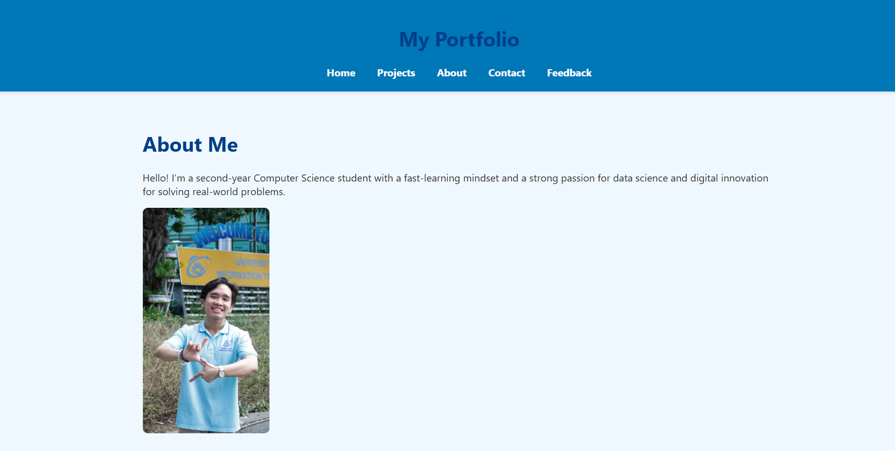

# Simple Portfolio Website with Flask

Welcome to the **Simple Portfolio Website** built using **Flask** – a minimal, clean, and fully functional portfolio template for developers. This project aims to help individuals showcase their personal projects, skills, and contact information through a simple yet elegant web interface powered by Python Flask.



## 🗂️ Table of Contents

- [✨ Features](#-features)
- [🗂️ Repository Structure](#️-repository-structure)
- [⚙️ Installation](#️-installation)
- [🎯 Usage](#-usage)
- [📄 License](#-license)
- [🤝 Contributing](#-contributing)
- [🧠 Acknowledgements](#-acknowledgements)
- [⭐ Future Enhancements](#-future-enhancements)

---

## ✨ Features

- **Flask Backend:** Lightweight Flask server serving dynamic HTML templates.
- **Jinja2 Templates:** Render dynamic project data using Jinja2 inside `index.html`.
- **Responsive UI:** Simple, responsive layout that adapts to desktop and mobile.
- **Project Listings:** List all your personal projects with image, title, description, and links.
- **Scalable Structure:** Codebase structured for future extension (e.g., database integration).
- **Demo Included:** Preview image included for a quick look at the interface.


---

## 🗂️ Repository Structure
```
├── pycache/ # Compiled Python files
├── instance/ # Flask instance folder (db files)
├── static/ # CSS styles, images (assets)
├── templates/ # HTML templates
├── Portfolio_Website_app.py # Main Flask application
├── demoWeb.png # Preview image of the website
├── requirements.txt # Python dependencies
├── projects_data.py # (Deprecated) Previous project data structure
├── Procfile # For deployment (e.g. Render/Heroku)
└── README.md # Project documentation (this file)
└── LICENSE

```
---

## ⚙️ Installation

1.  **Clone the repository:**

  ```bash
  git clone https://github.com/paht2005/simple-portfolio-website-with-flask.git
  cd simple-portfolio-website-with-flask
  ```

2.  **Install dependencies:**

   ```bash
   pip install -r requirements.txt
   ```

3.  **Execute project scripts:**

   ```bash
   python Portfolio_Website_app.py # or python3 Portfolio_Website_app.py
   ```
4. **Open browser:**
    
- Visit: `http://127.0.0.1:5000/`

---
## 🎯 Usage
-   Add your own project info in the index.html template.
- Customize the HTML/CSS in templates/index.html and static/ folder.
- Add your personal info, links, and profile section.
- For deployment, update Procfile or use platforms like Render, Railway, or Heroku.
---
## 📄 License
This project is licensed under the MIT License. See the [LICENSE](./LICENSE) file for details.

---
## 🤝 Contributing
Contributions are welcome!
Feel free to:
-   Submit pull requests
- Suggest features
- Open issues for bugs

📩Contact: **Nguyễn Công Phát** – congphatnguyen.work@gmail.com

---
## 🧠 Acknowledgements
- **Flask** – Python web micro-framework
- **Jinja2** – Templating engine
- **HTML/CSS** – Frontend interface
- **GitHub** – Version control and collaboration
---
## ⭐ Future Enhancements
- ** Database Integration:** Store and retrieve project info dynamically.
- **Multi-Page Support:** Add separate pages for About, Contact, Resume.
- **Contact Form:** Add working contact form with backend handling.
- **CMS Integration:** Manage portfolio content via admin dashboard.
- **UI Themes:** Add support for light/dark mode or theme switching.
